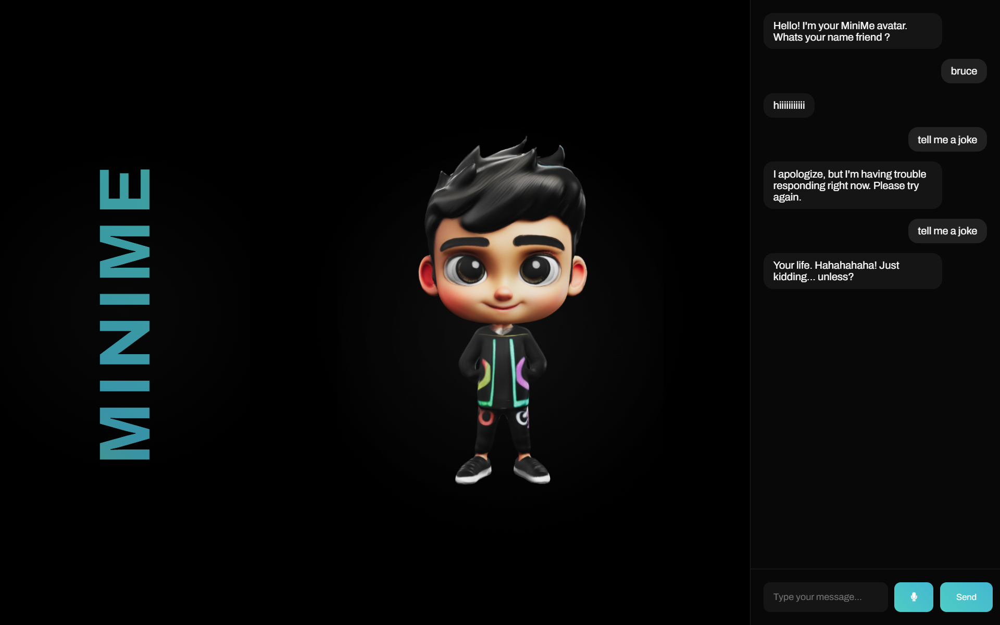

# [Project Name] 🎯

## Basic Details
### Team Name: [Name]

### Team Members
- Team Lead: Devadarsan C P - St. Joseph's College of Engineering and Technology, Palai
- Member 2: Vinayapriya C C - St. Joseph's College of Engineering and Technology, Palai
- Member 3: Avanthika S - St. Joseph's College of Engineering and Technology, Palai

### Project Description
MiniMe is an interactive AI avatar that combines real-time voice interaction with a sassy, over-dramatic personality. Featuring text-to-speech capabilities and fluid animations, it creates engaging conversations while displaying dynamic visual responses through a sleek, modern interface. The avatar responds to both text and voice input with witty, energetic replies, making everyday interactions more entertaining.

### The Problem (that doesn't exist)
People are bored of polite, sensible virtual assistants. Life’s too short for “How can I help you today?” when you could have an AI with some sass.

### The Solution (that nobody asked for)
the snarky, over-dramatic AI avatar who makes every interaction an experience. With voice, animations, and witty comebacks, MiniMe adds spice to your day and makes sure you’re never bored talking to a screen.

## Technical Details
### Technologies/Components Used
For Software:
-Language Used HTML: For structuring the web page.
CSS: For styling and layout.
JavaScript: For interactivity, DOM manipulation, and API integration.
Python : for facial features extraction
-Frameworks used elevenlabs api
google ai studio api
- Libraries used
dlib python
Font Awesome: For icons, such as the microphone icon.
Web Speech API:
- [Tools used]

### Implementation
used google ai studio api to create the chat bot 
text to speech is done using the api key of elevenlabs
dlib (shape_predictor_68_face_landmarks.data) to extract facial features was from images ( created from scratch not accurate and couldnt use it here cos of the 3d issues so here its an image however i have uploaded the files)
# Installation
run the html file 
note : give your own api key in google api key in the script
https://aistudio.google.com/app/apikey (to create google api key)
https://elevenlabs.io/app/settings/api-keys (to create a elevenlavs api key)

# Run
run the minime ai.html in web browser 

### Project Documentation
For Software:

# Screenshots (Add at least 3)

just a random prompt to show its humor

solving math equations

*Add caption explaining what this shows*
showing its humor

# Diagrams

*Add caption explaining your workflow*

For Hardware:

# Schematic & Circuit

*Add caption explaining connections*

*Add caption explaining the schematic*

# Build Photos

*List out all components shown*

*Explain the build steps*

*Explain the final build*

### Project Demo
# Video
[Add your demo video link here]
*Explain what the video demonstrates*

# Additional Demos
[Add any extra demo materials/links]

## Team Contributions
Devadarsan C P : developing both backend ,frontend and ml 
Vinayapriya C C : 3d design , ui ux , research
Avanthika S: research and script developing

---
Made with ❤️ at TinkerHub Useless Projects 

