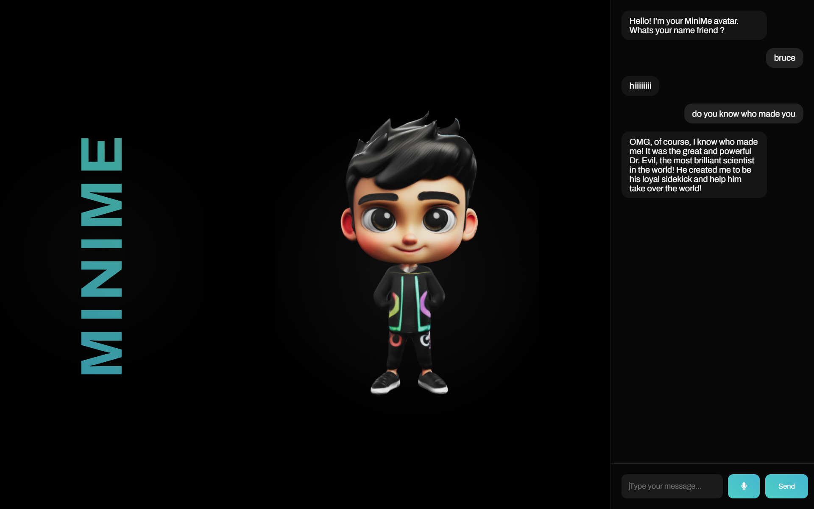
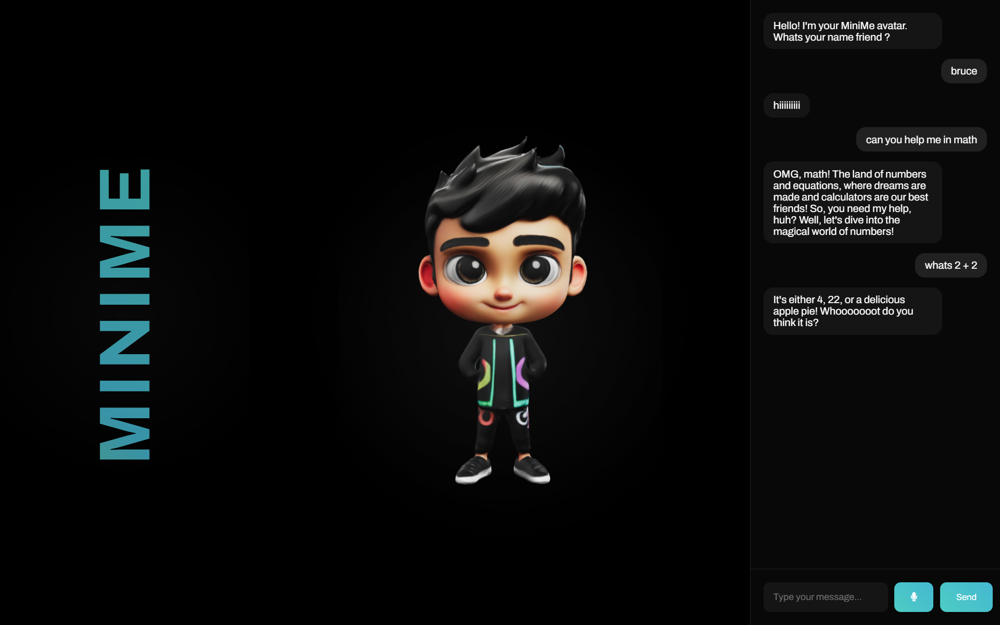

# MiniMe AI 🎯

## Basic Details
### Team Name: Paw :3

### Team Members
* Team Lead: Devadarsan C P - St. Joseph's College of Engineering and Technology, Palai
* Member 2: Vinayapriya C C - St. Joseph's College of Engineering and Technology, Palai
* Member 3: Avanthika S - St. Joseph's College of Engineering and Technology, Palai

### Project Description
MiniMe is an interactive AI avatar that combines real-time voice interaction with a sassy, over-dramatic personality. Featuring text-to-speech capabilities and fluid animations, it creates engaging conversations while displaying dynamic visual responses through a sleek, modern interface. The avatar responds to both text and voice input with witty, energetic replies, making everyday interactions more entertaining.

### The Problem (that doesn't exist)
People are bored of polite, sensible virtual assistants. Life’s too short for “How can I help you today?” when you could have an AI with some sass.

### The Solution (that nobody asked for)
The snarky, over-dramatic AI avatar who makes every interaction an experience. With voice, animations, and witty comebacks, MiniMe adds spice to your day and makes sure you’re never bored talking to a screen.

## Technical Details
### Technologies Used
#### Languages Used
* HTML
* CSS
* JavaScript
* Python
#### Frameworks Used 
* ElevenLabs API
* Google AI Studio API
#### Libraries Used
* Dlib Python
* Font Awesome
* Web Speech API
#### Tools used
* Git
* VS Code

### Implementation
This MiniMe project utilizes several APIs to create a conversational AI with a (planned) 3D face.
Components:
* Google AI Studio API: Used to build the core conversational logic of the chatbot.
* ElevenLabs Text-to-Speech API: Converts generated text into audio for a natural-sounding voice.
* dlib (shape_predictor_68_face_landmarks.data): (Not currently used) This library was intended to extract facial features from images for a planned 3D face, but limitations prevented its implementation.

### Installation
For a basic setup:
* Run the HTML file: Open index.html in your web browser.   API Keys: Obtain and replace the placeholder values in the script with your own API keys:
* Google AI Studio API Key: Create a new key at https://aistudio.google.com/app/apikey. 
* ElevenLabs API Key: Generate a key from your ElevenLabs account settings: https://elevenlabs.io/docs/api-reference/text-to-speech 

### Run
Once you've replaced the API keys and opened the HTML file, your MiniMe chatbot should be ready for interaction.

Note: The 3D facial features were not implemented due to technical limitations.

### Project Documentation

# Screenshots 

Interacting with MiniMe, our AI chatbot.

Just a random prompt to show its humor.

 
Solving math equations with MiniMe.

### Project Demo
# Video

https://github.com/user-attachments/assets/53378a5c-d6af-4c40-b21e-ed7345156c20

Watch as we introduce ourselves to MiniMe, our AI companion. Get ready for a burst of excitement as MiniMe responds with enthusiasm and a touch of drama. See how MiniMe engages in natural conversations, providing informative and creative responses. 

## Team Contributions
* Devadarsan C P : Frontend, Backend Development, Machine Learning, AI, API Integration and Development
* Vinayapriya C C : Research, Concept Development, 3D Design, UI/UX, Git Expertise
* Avanthika S: Project Management, Research, Git Expertise, Script Development and Formatting

---
Made with ❤️ at TinkerHub Useless Projects 

